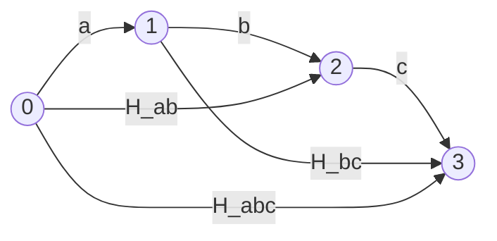
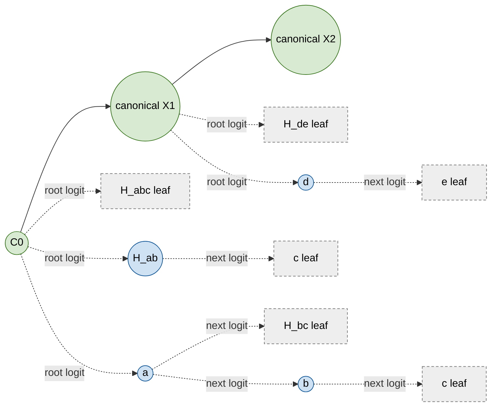
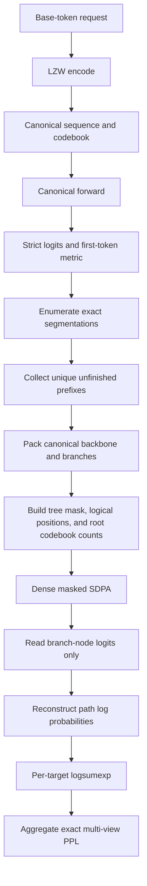

# Multi-View Perplexity and Tree Attention

This document defines Zip2Zip multi-view perplexity (PPL) and explains how
cross-target tree attention computes the exact complete-segmentation marginal
efficiently.

## 1. Motivation

An LZW codebook can represent the same base-token string with multiple token
segmentations. For example:

```text
H_abc -> [a, b, c]
```

Under the current codebook, the same string may have four equivalent
representations:

```text
[H_abc]
[H_ab, c]
[a, H_bc]
[a, b, c]
```

All four decode to `[a, b, c]`. Strict PPL scores only the canonical token
`H_abc`, treating probability assigned to the other correct segmentations as
an error.

## 2. Metrics

Let the canonical target be $x_i$, with canonical context $C_i=x_{<i}$. Let
$S(x_i)$ contain all complete segmentations that decode to
$\operatorname{expand}(x_i)$.

### 2.1 Strict likelihood

$$
p_{\mathrm{strict}}(x_i\mid C_i)=p(x_i\mid C_i).
$$

### 2.2 First-token multi-view

The historical implementation sums the distinct first tokens of all valid
segmentations:

$$
p^*_{\mathrm{first}}(x_i\mid C_i)
=\sum_{f\in\mathcal F(x_i)}p(f\mid C_i).
$$

It does not score the continuation after the first token, so it is an upper
bound on the exact probability.

### 2.3 Exact multi-view

The exact metric scores every complete segmentation autoregressively and sums
their probability mass:

$$
p_{\mathrm{exact}}(x_i\mid C_i)
=\sum_{s\in S(x_i)}
\prod_{j=1}^{|s|}
p(s_j\mid C_i,s_{<j}).
$$

The implementation accumulates each path in log space and applies
`logsumexp`:

$$
\log p_{\mathrm{exact}}
=\operatorname{logsumexp}_{s\in S(x_i)}
\left[\sum_j\log p(s_j\mid C_i,s_{<j})\right].
$$

The probabilities satisfy

$$
p^*_{\mathrm{first}}\ge p_{\mathrm{exact}}\ge p_{\mathrm{strict}},
$$

so perplexity has the reverse ordering:

$$
\mathrm{PPL}_{\mathrm{first}}
\le \mathrm{PPL}_{\mathrm{exact}}
\le \mathrm{PPL}_{\mathrm{strict}}.
$$

## 3. Segmentation DAG and required nodes

`multi_view_segmentations` treats a target expansion as a DAG over base-token
offsets:

- A base token spans one offset.
- A matching hypertoken spans multiple offsets.
- Each complete path from offset 0 to the end is one segmentation.
- Hypertokens are filtered by the codebook entries available at the target
  root.

For `[a, b, c]`:



This gives:

```text
[H_abc]
[H_ab, c]
[a, H_bc]
[a, b, c]
```

with probabilities:

```text
p(H_abc | C)
p(H_ab | C) * p(c | C, H_ab)
p(a | C) * p(H_bc | C, a)
p(a | C) * p(b | C, a) * p(c | C, a, b)
```

The canonical forward already provides:

```text
p(H_abc | C), p(H_ab | C), p(a | C)
```

Additional forwards are needed only for unique, non-empty prefixes that still
predict another token:

```text
[H_ab] -> p(next | C, H_ab)
[a]    -> p(next | C, a)
[a, b] -> p(next | C, a, b)
```

The final token of a complete path needs no continuation distribution and is
not a tree node. Path enumeration is $O(2^{n-1})$ in the worst case. With the
current `max_subtokens=4`, Transformer execution dominates this small search.

## 4. Cross-target tree attention

For long-text PPL, lm-eval divides text into scoring windows. Each window
contains context and a continuation whose likelihood is scored. This windowing
and context reuse are standard lm-eval behavior, not part of tree attention.

Within one scoring window, all targets share a canonical backbone. Each
target's unfinished segmentation prefixes form isolated branches attached to
the corresponding backbone position.

In this example:

- The logits at `C0` score target `X1=H_abc`.
- The logits at canonical `X1` score target `X2=H_de`.
- Blue circles are packed prefix nodes.
- Gray leaves are probabilities read from a distribution, not packed inputs.



The Transformer receives:

```text
[C0, X1, X2, H_ab, a, b, d]
 |-- backbone --|  |-- prefix nodes --|
```

Physical order does not define node history. The attention mask, logical
position, and codebook count define each computation.

## 5. Complete tree-attention mask

A `1` means that a query may read the corresponding key:

| Query / Key | C0 | X1 | X2 | H_ab | a | b=[a,b] | d |
|---|---:|---:|---:|---:|---:|---:|---:|
| C0 | 1 | 0 | 0 | 0 | 0 | 0 | 0 |
| X1 | 1 | 1 | 0 | 0 | 0 | 0 | 0 |
| X2 | 1 | 1 | 1 | 0 | 0 | 0 | 0 |
| H_ab (X1 branch) | 1 | 0 | 0 | 1 | 0 | 0 | 0 |
| a (X1 branch) | 1 | 0 | 0 | 0 | 1 | 0 | 0 |
| b=[a,b] (X1 branch) | 1 | 0 | 0 | 0 | 1 | 1 | 0 |
| d (X2 branch) | 1 | 1 | 0 | 0 | 0 | 0 | 1 |

Matrix form:

```text
             keys
             C0 X1 X2 Hab a  b  d
queries C0 [ 1, 0, 0, 0, 0, 0, 0 ]
        X1 [ 1, 1, 0, 0, 0, 0, 0 ]
        X2 [ 1, 1, 1, 0, 0, 0, 0 ]
        Hab[ 1, 0, 0, 1, 0, 0, 0 ]
        a  [ 1, 0, 0, 0, 1, 0, 0 ]
        b  [ 1, 0, 0, 0, 1, 1, 0 ]
        d  [ 1, 1, 0, 0, 0, 0, 1 ]
```

This guarantees:

1. The canonical backbone uses ordinary causal attention.
2. Canonical tokens cannot see branch nodes.
3. An `X1` branch sees only `C0` and its own ancestors, not canonical `X1`.
4. An `X2` branch may see canonical `C0, X1`.
5. Branches from different targets cannot see one another.
6. Sibling branches of one target cannot see one another.
7. Each node sees itself because its hidden state predicts the next token.

In general, logits from canonical input row $t$ predict
`compressed[t+1]`. If a node represents prefix
$u=(u_1,\ldots,u_d)$, its allowed keys are

$$
A(t,u)
=\{\text{canonical rows }0,\ldots,t\}
\cup
\{u_{:1},u_{:2},\ldots,u_{:d}\}.
$$

All other positions are masked. Identical token IDs or prefixes belonging to
different targets remain distinct physical nodes because their canonical
histories differ.

## 6. Positions, codebooks, and equivalence

### 6.1 RoPE positions

A branch node cannot use its physical packed-tensor index. When
`base_token_positions=True`:

```text
canonical position
    = base offset after consuming the current canonical token - 1

branch position
    = base end of the target context
      + decoded base length of the prefix
      - 1
```

Otherwise:

```text
branch position = target root position + len(prefix)
```

### 6.2 Codebook visibility

- One materialized `cb_tensor` is shared by the scoring window.
- Valid segmentation hypertoken IDs come from finite logits at the target root.
- Every branch node keeps its target-root output availability/count. It does not
  gain rows from branch-prefix length or packed physical position.
- For v0.6.4 and other legacy-mask checkpoints, the target-root count is
  `target_context_length`.

Earlier packed branches therefore cannot reveal extra codebook entries to a
later node.

### 6.3 Why packing is equivalent

For each branch node:

1. Its token embedding, RoPE position, and target-root codebook availability
   match the standalone sequential scorer.
2. Its mask exposes the same canonical and ancestor rows.
3. Each Transformer layer therefore produces the same hidden state and
   next-token distribution.
4. Paths use the same exact aggregation; tree attention changes only execution
   scheduling.

The fp32 tests compare tree and sequential results target by target and cover
sibling isolation, cross-target isolation, base-token positions, legacy and
online masks, chunked trees, and canonical-only replay for online checkpoints.

## 7. Execution flow



Implementation details:

- Root logits are reused from the canonical forward.
- `logit_positions` restricts vocabulary projection to branch nodes in the
  tree forward.
- A dense Boolean mask is built on CPU and transferred to GPU once.
- Each tree chunk contains at most 512 branch nodes by default to bound peak
  memory.
- Unsupported attention or RoPE configurations fall back to the sequential
  reference scorer.

## 8. PPL aggregation and CLI

lm-eval already computes the denominator for strict PPL. The implementation
reuses it through the ratio between strict and multi-view log-likelihood sums:

$$
r=\frac{M}{S},\qquad
\mathrm{PPL}_{\mathrm{multi}}
=\mathrm{PPL}_{\mathrm{strict}}^r,\qquad
\mathrm{BPB}_{\mathrm{multi}}
=\mathrm{BPB}_{\mathrm{strict}}r.
$$

Result fields:

```text
multi_view_*                       # exact complete-path metric
segmentation_gap_bits_per_byte
first_token_multi_view_*           # first-token upper bound
first_token_segmentation_gap_bits_per_byte
```

Multi-view evaluation is enabled by default and reports both exact and
first-token values:

```bash
uv run python scripts/eval_harness.py \
  --ckpt_dir /path/to/checkpoint \
  --tokenizer microsoft/Phi-3.5-mini-instruct \
  --preset perplexity \
  --tasks wikitext \
  --resume_wandb_id none \
  --no_wandb
```

Tree attention is internal to the exact scorer and needs no extra flag.

## 9. Validation

Full WikiText test-set results for the v0.6.4 step-8000 checkpoint:

| Metric | Byte PPL |
|---|---:|
| Strict | 1.65739827 |
| Exact multi-view | 1.62907073 |
| First-token multi-view | 1.58826624 |

The expected ordering holds:

$$
\mathrm{BPPL}_{\mathrm{first}}
\le \mathrm{BPPL}_{\mathrm{exact}}
\le \mathrm{BPPL}_{\mathrm{strict}}.
$$

### Performance

The first-token-only evaluation took 65.0 seconds. The original sequential
exact scorer increased end-to-end evaluation time to 2,675.7 seconds, or
41.16x the first-token baseline. The current fixed-root tree-attention scorer
completed in 103.0 seconds, or 1.58x the first-token baseline:

| Implementation | Evaluation time | Relative to first-token |
|---|---:|---:|
| First-token only | 65.0s | 1.00x |
| Original sequential exact | 2,675.7s | 41.16x |
| Current cross-target tree attention | 103.0s | 1.58x |

Tree attention is therefore approximately 26.0x faster than the original
sequential exact scorer end to end. Absolute times vary with hardware and
cluster load, but the comparison shows that exact multi-view scoring is now
close to the cost of first-token evaluation.

Tree execution statistics:

```text
exact_forest_forwards:             346
exact_forest_targets:           39,997
exact_forest_nodes:             56,380
exact_forest_backbone_tokens:  300,459
exact_forest_packed_tokens:     356,839
exact_forest_max_packed_tokens:   1,194
```

The `exact_forest_*` JSON names are retained for compatibility; they describe
the cross-target tree-attention implementation documented here.

## 10. Code locations and boundaries

- Segmentation enumeration, prefix deduplication, and `logsumexp`:
  `src/zip2zip_core/multi_view.py`
- Exact scorer and cross-target tree attention:
  `src/zip2zip_core/lm_eval_adapter.py`
- Explicit tree-attention SDPA and `logit_positions`:
  `src/zip2zip_core/model.py`
- CLI and metric output: `scripts/eval_harness.py`
- RCP entry point: `scripts/eval_ckpt_rcp.sh`
- Tests: `tests/test_multi_view.py`,
  `tests/test_online_codebook_mask.py`

Current boundaries:

- Evaluation only; training loss and ordinary training attention are unchanged.
- The tree uses a dense SDPA mask rather than FlexAttention/BlockMask.
- The canonical backbone is recomputed once in the tree forward; the original
  canonical forward's KV cache is not reused.
- Different packed shapes in bf16 can produce final PPL differences on the
  order of `1e-5`.
